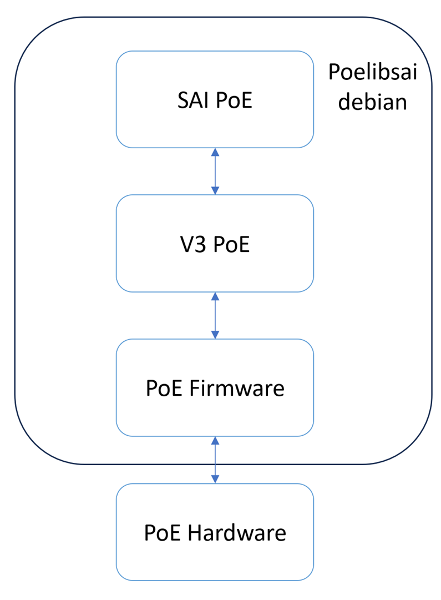

# poe-v3

PoE SAI solution based on the Marvell V3 protocol

## v3 protocol

PoE API and protocol between the Host software and the Power management (PM) running on the service-CPU (SCPU). The data transfer mechanism is IPC, which allows both the host and SCPU to communicate via shared memory.

# Components

| **Component**                                         | **Description**                                                                       |
| ----------------------------------------------------------- | ------------------------------------------------------------------------------------------- |
| **poelibsai-debian/usr/lib/libsai.so**                | shared library that provides SAI implementation                                             |
| **poelibsai-debian/usr/lib/libapp_scpu.a**            | vendor specific library for communication between SAI and the hardware (ARM64 architecture) |
| **sai-poe-implementation/board_info/xml & md5 files** | files that contain info relevant to the board (ports, pse, etc)                             |
| **poelibsai**                                         | debian that contains all data and functions to run PoE in SAI environment                   |
| **sai-poe-implementation/PDLIB**                      | parsing mechanism                                                                           |

# Overview



| **Component**     | **Description**                                                                                                |
| ----------------------- | -------------------------------------------------------------------------------------------------------------------- |
| **SAI PoE**       | SAI PoE source code (sai-poe-implementation/src/sai/sai_poe.c)                                                       |
| **V3 PoE**        | Takes SAI requests and converts into V3 structures to send to the PoE firmware (sai-poe-implementation/src/poe_v3.c) |
| **Shared Memory** | Communication method between the application and the PoE firmware, will vary depending on the board architecture     |
| **PoE Firmware**  | PoE firmware that communicates with the PoE hardware (vendor specific)                                               |
| **PoE Hardware**  | PoE hardware (depends on the board architecture)                                                                     |

# More information

[SAI PoE Proposal (HLD)](https://github.com/DanielaMurin/SAI/blob/17fc43ce7a294430ea8e89b79c2f273b88887454/doc/SAI-Proposal-PoE.md) In opencomputeproject/SAI

# How to build

Tested on Ubuntu 20.04.6 LTS using aarch64-linux-gnu-gcc (Ubuntu 9.4.0-1ubuntu1~20.04.2) 9.4.0 and Marvell Tool chain using GCC 12 for the ARM64 architecture.

## Make poelibsai.deb

```sh
cd sai-poe-implementation
./build_and_package.sh
```

## Step by step

```sh
cd ./sai-poe-implementation
make
cd ..
cp ./sai-poe-implementation/board_info/rdac5xpoe.xml .
md5sum rdac5xpoe.xml > rdac5xpoe.md5
mv rdac5xpoe* ./poelibsai-debian/usr/lib/
cp ./sai-poe-implementation/libsai.so ./poelibsai-debian/usr/lib/
dpkg-deb --build poelibsai-debian poelibsai.deb
```

<a href="https://www.marvell.com/">
  
</a>
