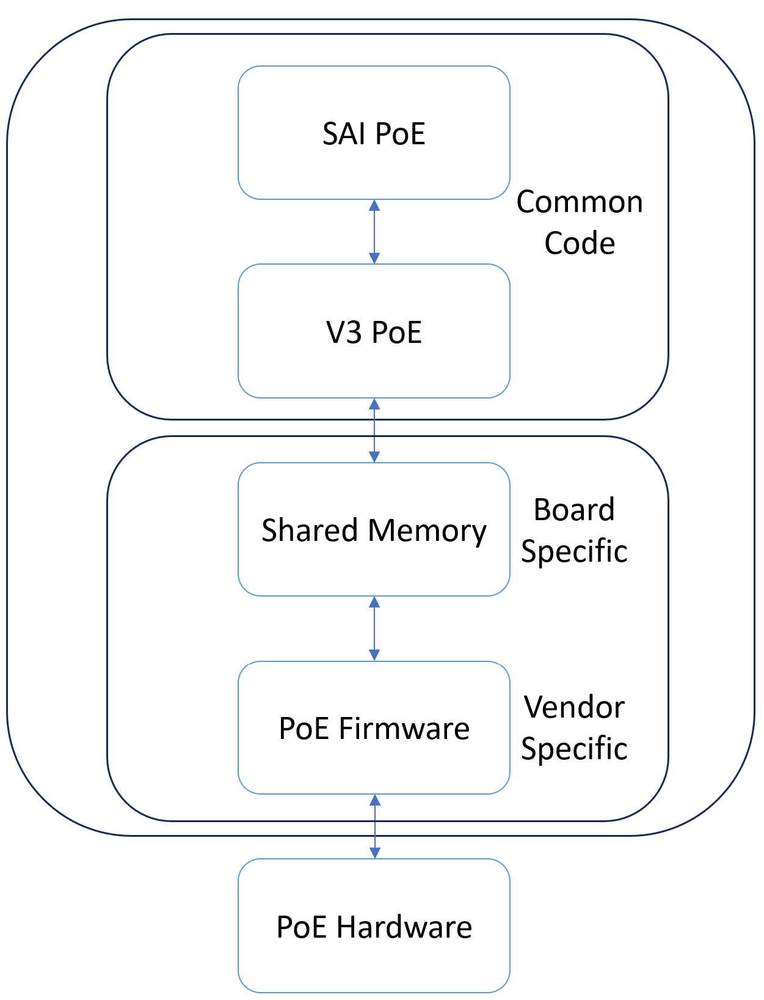

# poe-v3
PoE SAI solution based on the Marvell V3 protocol

## v3 protocol

PoE API and protocol between the Host software and the Power management (PM) running on the service-CPU (SCPU). The data transfer mechanism is IPC, which allows both the host and SCPU to communicate via shared memory.

# Components

| **Component**     | **Description**                                                                       |
| ----------------------- | ------------------------------------------------------------------------------------------- |
| **libsai.so**     | shared library that provides SAI implementation                                             |
| **xml/md5 files** | files that contain info relevant to the board (ports, pse, etc)                             |
| **libapp_scpu.a** | vendor specific library for communication between SAI and the hardware (ARM64 architecture) |
| **poelibsai**     | debian that contains all data and functions to run PoE in SAI environment                   |
| **sai_poe.c**     | sai code implementation                                                                     |
| **poe_v3.c**      | converts sai requests into structures that PoE can read/write                               |
| **PDLIB**         | parsing mechanism                                                                           |

# Overview


# More information
[SAI PoE Proposal (HLD)](https://github.com/DanielaMurin/SAI/blob/17fc43ce7a294430ea8e89b79c2f273b88887454/doc/SAI-Proposal-PoE.md)

# How to build

## Make poelibsai.deb

```sh
cd sai-poe-implementation
./build_and_package.sh
```

## Step by step

```sh
cd ./sai-poe-implementation
make
cd ..
cp ./sai-poe-implementation/board_info/rdac5xpoe.xml .
md5sum rdac5xpoe.xml > rdac5xpoe.md5
mv rdac5xpoe* ./poelibsai-debian/usr/lib/
cp ./sai-poe-implementation/libsai.so ./poelibsai-debian/usr/lib/
dpkg-deb --build poelibsai-debian poelibsai.deb
```

<a href="https://www.marvell.com/">
  
</a>
