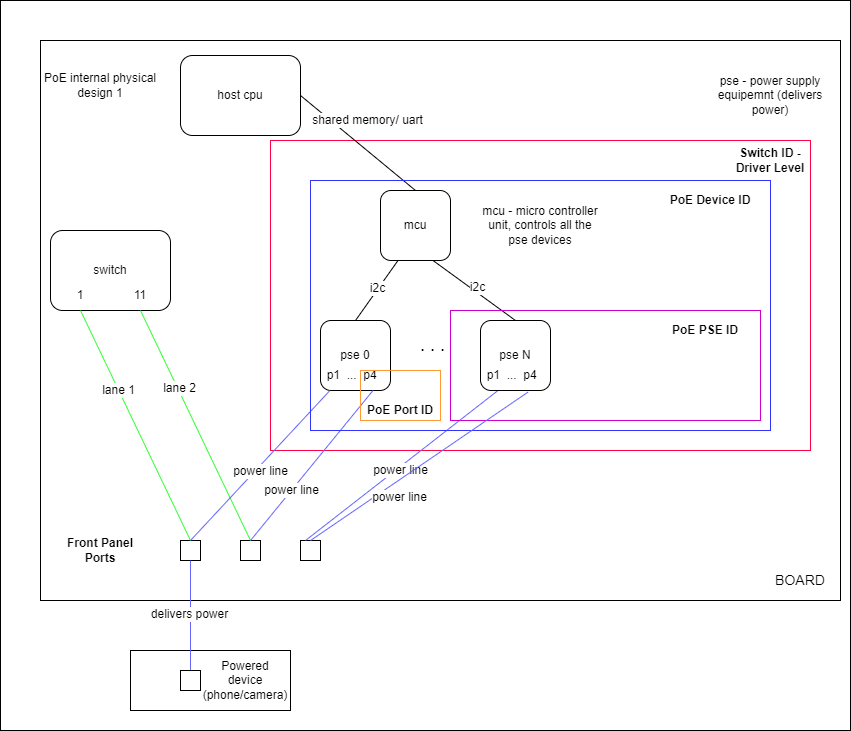

SAI PoE support for SAI version 1.13.?

| Title       | PoE                    |
| ----------- | ---------------------- |
| Authors     | Daniela Murin, Marvell |
| Status      | In review              |
| Type        | Standards track        |
| Created     | 25/02/2024             |
| Updated     | 26/02/2024             |
| SAI-Version | 1.13.?                 |
## Abbreviations and Information

| **Term** | **Definition**                                                                                    |
| -------- | ------------------------------------------------------------------------------------------------- |
| PoE      | Power over Ether                                                                                  |
| PSE      | Power Sourcing Equipment                                                                          |
| PoE Port | Ethernet port that can deliver power and info to devices, located on the front panel of the board |
# Overview

Power over Ethernet, or PoE, describes any of several standards that pass electric power along with data on twisted-pair Ethernet cabling. This allows a single cable to provide both a data connection and enough electricity to power networked devices such as wireless access points (WAPs), IP cameras and VoIP phones.
# Proposal

The current SAI does not support PoE. We will implement PoE in a way that any vendor can provide their own PoE hardware and software solution.
# Specification

## Added a POE switch type to file saiswitch.h
```
/**
 * @brief Attribute data for #SAI_SWITCH_ATTR_TYPE
 */
typedef enum _sai_switch_type_t
{
    /** Switch type is Switching Network processing unit */
    SAI_SWITCH_TYPE_NPU,

    /** Switch type is PHY */
    SAI_SWITCH_TYPE_PHY,

    /** Switch type is VOQ based NPU */
    SAI_SWITCH_TYPE_VOQ,

    /** Switch type is Fabric switch device */
    SAI_SWITCH_TYPE_FABRIC,

    /** Switch type is PoE (Power over Ethernet) */
    SAI_SWITCH_TYPE_POE,

} sai_switch_type_t;
```
## Addition to file sai.h
```
{ ...
SAI_API_POE_DEVICE       = 51, /**< sai_poe_device_api_t */
SAI_API_POE_PSE          = 52, /**< sai_poe_pse_api_t */
SAI_API_POE_PORT         = 53, /**< sai_poe_port_api_t */
SAI_API_MAX,                   /**< total number of APIs */
...
} sai_api_t;
```

## PoE Hardware Design Example


### PoE Device ID
This object is used to access data that is device (system) wide. In many cases, one PoE device instance will have access to all of the PoE hardware and components.

### PoE PSE ID
This object is used to access data from the Power Sourcing Equipment devices in the board. Such as PSE temperatures, versions and statuses. There can be multiple PSEs in one board.

### PoE Port ID
This object is used to access data on a port level. PoE ports supply power using an ethernet cable. PoE port gives access to read data and configure these ports.
## Example of how to Initialize PoE
```
Create Switch ID
Create at least one PoE Device ID 
Get PoE PSE list from PoE Device
Get PoE Port list from PoE Device
Create PoE PSE objects
Create PoE Port objects
```
## New attributes for the PoE Device
```
typedef enum _sai_poe_device_attr_t

{
    /**
     * @brief Start of attributes
     */
    SAI_POE_DEVICE_ATTR_START,
    /**
     * @brief Device Information for switch initialization.
     *
     * Hardware information format is based on SAI implementations by vendors.
     * String is NULL terminated. Format is vendor specific.
     * Example: Like PCI location, I2C address, MDIO address, MDIO bus SysFS information etc.
     * In case of NULL, use the default PoE associated switch id.
     *
     * @type string
     * @flags CREATE_ONLY
     * @default empty
     */
    SAI_ATTR_POE_HARDWARE_INFO = SAI_POE_DEVICE_ATTR_START,
```
The PoE hardware information is used to tell the PoE driver how to initialize itself, based on the PoE hardware. The information is specific per board and must be provided.
E.g. I2C, UART, MCU

```
    /**
     * @brief a list of all the poe PSE devices
     *
     * @type sai_object_list_t
     * @flags READ_ONLY
     */
    SAI_POE_DEVICE_ATTR_POE_PSE_LIST,
```
Get a list of all PoE PSE devices in the board.

```
    /**
     * @brief a list of all the poe ports
     *
     * @type sai_object_list_t
     * @flags READ_ONLY
     */
    SAI_POE_DEVICE_ATTR_POE_PORT_LIST,

```
Get a list of PoE ports in the board.

```
    /**
     * @brief the total power in the device
     *
     * @type sai_uint32_t
     * @flags READ_ONLY
     */
    SAI_POE_DEVICE_ATTR_TOTAL_POWER,

```  
Get the total power, in watts, that the board can provide.

```
    /**
     * @brief total power consumption
     *
     * @type sai_uint32_t
     * @flags READ_ONLY
     */
    SAI_POE_DEVICE_ATTR_POWER_CONSUMPTION,

```
Get the total power consumption, in watts, for the board.

```
    /**
     * @brief poe device version and information
     *
     * @type char
     * @flags READ_ONLY
     */
    SAI_POE_DEVICE_ATTR_VERSION,

```
Get the PoE software version.

```
    /**
     * @brief power limit mode
     *
     * @type sai_poe_device_limit_mode_t
     * @flags CREATE_AND_SET
     * @default SAI_POE_DEVICE_LIMIT_MODE_TYPE_CLASS_LIMIT
     */
    SAI_POE_DEVICE_ATTR_POWER_LIMIT_MODE,

```  
Get/Set the PoE Power Limit Mode. (A mode for managing power limits)

## New attributes for the PoE PSE devices
```
    /**
     * @brief poe pse PSE software version
     *
     * @type char
     * @flags READ_ONLY
     */
    SAI_POE_PSE_ATTR_PSE_SOFTWARE_VERSION = SAI_POE_PSE_ATTR_START,

``` 
Get the PSE software version.

```
    /**
     * @brief poe pse PSE hardware version
     *
     * @type char
     * @flags READ_ONLY
     */
    SAI_POE_PSE_ATTR_PSE_HARDWARE_VERSION,

``` 
Get the PSE hardware version.

```
    /**
     * @brief temperature (in celsius) of the PSE
     *
     * @type int16_t
     * @flags READ_ONLY
     */
    SAI_POE_PSE_ATTR_TEMPERATURE,
``` 
Get the PSE temperature.

```
    /**
     * @brief statuses for each PSEs
     *
     * @type sai_poe_device_pse_status_id_t
     * @flags READ_ONLY
     */
    SAI_POE_PSE_ATTR_PSE_STATUS,

``` 
Get the PSE status. (Active/Fail)
## New attributes for the PoE Ports
```

typedef enum _sai_poe_port_attr_t

{
    /**
     * @brief Start of attributes
     */
    SAI_POE_PORT_ATTR_START,
    /**
     * @brief PoE device ID
     *
     * @type sai_object_id_t
     * @flags MANDATORY_ON_CREATE | CREATE_ONLY
     */
    SAI_POE_DEVICE_ID = SAI_POE_PORT_ATTR_START,
```
SAI_POE_DEVICE_ID that was defined in the device section. Since every port is under the management of the PoE device, that device_id must be provided to create a port.

```
    /**
     * @brief PoE port front panel ID
     *
     * @type sai_poe_port_front_panel_id_t
     * @flags MANDATORY_ON_CREATE | CREATE ONLY
     */
    SAI_POE_PORT_ATTR_FRONT_PANEL_ID,
```
The PoE port ID located in the front panel. The port ID is specific per board and must be provided.

```
    /**
     * @brief PoE port enabled/disabled state, as set by the user
     *
     * @type bool
     * @flags CREATE_AND_SET
     * @default false
     */
    SAI_POE_PORT_ATTR_ADMIN_ENABLED_STATE,
```
User enable or disable PoE port. Allows the user to manage which ports can deliver power.

```
    /**
     * @brief PoE port power limit mode
     *
     * @type sai_uint32_t
     * @flags CREATE_AND_SET
     * @default maximum value that the port can provide
     */
    SAI_POE_PORT_ATTR_POWER_LIMIT,
``` 
Set/Get the power limit per port.

```
    /**
     * @brief PoE port priority
     *
     * @type sai_poe_port_power_priority_t
     * @flags CREATE_AND_SET
     * @default SAI_POE_PORT_POWER_PRIORITY_TYPE_HIGH
     */
    SAI_POE_PORT_ATTR_POWER_PRIORITY,
```
Set the power priority per port. ()

```
    /**
     * @brief PoE port consumption information
     *
     * @type sai_poe_port_power_consumption_t
     * @flags READ_ONLY
     */
    SAI_POE_PORT_ATTR_CONSUMPTION,
```
Get detailed consumption information per port. (watts/volts/ampere/classes etc...)

```
    /**
     * @brief PoE port status of the port state
     *
     * @type sai_poe_port_status_id_t
     * @flags READ_ONLY
     */
    SAI_POE_PORT_ATTR_STATUS,
``` 
Get the port status. (off/searching/delivering power/fault)

```
    /**
     * @brief PoE port detailed status of the port state (string)
     *
     * @type char
     * @flags READ_ONLY
     */
    SAI_POE_PORT_ATTR_DETAILED_STATUS,
```
Get a detailed string with the current port status.

## Addition to file saitypes.h

```
{ ...
	/** @validonly meta->attrvaluetype == SAI_ATTR_VALUE_TYPE_POE_PORT_POWER_CONSUMPTION */
	sai_poe_port_power_consumption_t portpowerconsumption;
    
} sai_attribute_value_t;

```
Get the power consumption information per port.


```
{ ...
SAI_OBJECT_TYPE_POE_DEVICE               = 108,
SAI_OBJECT_TYPE_POE_PSE                  = 109,
SAI_OBJECT_TYPE_POE_PORT                 = 110,
...
} sai_object_type_t;
```

A new struct in saitypes.h that includes all the data for port consumption.
```
{ ...
/** @validonly meta->attrvaluetype == SAI_ATTR_VALUE_TYPE_POE_PORT_POWER_CONSUMPTION */
    sai_poe_port_power_consumption_t portpowerconsumption;

} sai_attribute_value_t;

/**
 * @brief Defines a port consumption structure
 */
typedef struct _sai_poe_port_power_consumption_t {

    /** Port power consumption value */
    sai_poe_port_active_channel_id_t active_channel; /* active channel a/b/ab */
    uint32_t voltage_in_volts; /* volts */
    uint32_t current_in_ma; /* milliAmpere */
    uint32_t consumption_in_mw; /* milliWatts */
    sai_poe_port_signature_type_id_t signature_type; /* single or dual signature port */
    sai_poe_port_class_method_id_t class_method; /* bt port class method type regular/auto */
    uint16_t measured_class_a; /* measured class for channel a */
    uint16_t assigned_class_a; /* assigned (final) class for channel a */
    uint16_t measured_class_b; /* dual signature bt port - measured class for channel b */
    uint16_t assigned_class_b; /* dual signature bt port - assigned (final) class for channel b*/
} sai_poe_port_power_consumption_t;
```
## Addition to file saimetadatatypes.h
```
/**
    /**
     * @brief Attribute value is the poe port consumption data.
     */
    SAI_ATTR_VALUE_TYPE_POE_PORT_POWER_CONSUMPTION,
} sai_attr_value_type_t;
```

## SAI functionality for PoE device/PSE/Ports
```
/**
 * @brief PoE device method table retrieved with poe_api_query()
 */
typedef struct _sai_poe_device_api_t
{
    sai_create_poe_device_fn               create_poe_device;
    sai_remove_poe_device_fn               remove_poe_device;
    sai_set_poe_device_attribute_fn        set_poe_device_attribute;
    sai_get_poe_device_attribute_fn        get_poe_device_attribute;
} sai_poe_device_api_t;

/**
 * @brief PoE PSE method table retrieved with poe_api_query()
 */
typedef struct _sai_poe_port_api_t
{
    sai_create_poe_pse_fn                 create_poe_pse;
    sai_remove_poe_pse_fn                 remove_poe_pse;
    sai_set_poe_pse_attribute_fn          set_poe_pse_attribute;
    sai_get_poe_pse_attribute_fn          get_poe_pse_attribute;
} sai_poe_pse_api_t;

/**
 * @brief PoE port method table retrieved with poe_api_query()
 */
typedef struct _sai_poe_port_api_t
{
    sai_create_poe_port_fn                 create_poe_port;
    sai_remove_poe_port_fn                 remove_poe_port;
    sai_set_poe_port_attribute_fn          set_poe_port_attribute;
    sai_get_poe_port_attribute_fn          get_poe_port_attribute;
} sai_poe_port_api_t;

```


## Examples
### Create a PoE device
The examples illustrate the following scenario:
- Create/Set/Get/Remove a PoE device or PoE port
-
```
void sai_create_poe_device() {
    sai_status_t status = SAI_STATUS_SUCCESS;
    sai_object_id_t sai_poe_device_id;
    sai_poe_device_api_t *poe_device_api;
    sai_attribute_t * attr_list = (sai_attribute_t * ) calloc(1,sizeof(sai_attribute_t));

    status = sai_api_query(SAI_API_POE_DEVICE, (void **)&poe_device_api);
    if (status != SAI_STATUS_SUCCESS) {
        return;
    }

	attr_list[0].id = SAI_ATTR_POE_HARDWARE_INFO;
    memcpy(attr_list[0].value.chardata, "MCU", sizeof("MCU"));

    status = poe_device_api->create_poe_device(
        &sai_poe_device_id, gswitch_id, 1, attr_list);
    if (status != SAI_STATUS_SUCCESS) {
        return;
    }

    return;
}
```

### Get PoE device attribute
```
void sai_get_poe_device() {
    sai_status_t status = SAI_STATUS_SUCCESS;
    sai_object_id_t sai_poe_device_id;
    sai_poe_device_api_t *poe_device_api;
    sai_attribute_t get_attr;
    
    status = sai_api_query(SAI_API_POE_DEVICE, (void **)&poe_device_api);
    if (status != SAI_STATUS_SUCCESS) {
        return;
    }
    
	memset(&get_attr, 0, sizeof(get_attr));
	get_attr.id = SAI_POE_ATTR_PORT_LIST;
    get_attr.value.objlist = get_poe_port_list;
    
	status = poe_device_api->get_poe_device_attribute(
							sai_poe_device_id,
							1,
							&get_attr);
							
	if (status != SAI_STATUS_SUCCESS) {
        return;
    }

	status = sai_api_query(SAI_API_POE_PORT (void **)&poe_port_api);
    if (status != SAI_STATUS_SUCCESS) {
        return;
    }

	for (uint32_t i = 0; i < poe_member_list_object_attribute.value.objlist.count; i++) {
		sai_create_poe_port(poe_member_list_object_attribute.value.objlist[i]);
	}
    return;
}
```

### Create PoE port
```
void sai_create_poe_port(sai_object_id_t sai_poe_port_id) {
    sai_status_t status = SAI_STATUS_SUCCESS;
    sai_poe_port_api_t *poe_port_api;

	status = sai_api_query(SAI_API_POE_PORT (void **)&poe_port_api);
    if (status != SAI_STATUS_SUCCESS) {
        return;
    }

    sai_attribute_t *attr_list = nullptr;
	sai_uint32_t attr_size = thrift_attr_list.size();
	sai_poe_alloc_attr(attr_list, attr_size);

	status = poe_port_api->create_poe_port(
        &sai_poe_port_id, switch_id, attr_count, attr_list);
	if (status != SAI_STATUS_SUCCESS) {
		return;
	}
}
```

### Set PoE Port Attribute
```
void sai_set_poe_port() {
    sai_status_t status = SAI_STATUS_SUCCESS;
    sai_object_id_t sai_port_id;
    sai_attribute_t sai_attr;
    sai_poe_port_api_t *poe_port_api;

    status = sai_api_query(SAI_API_ROUTE, (void **)&poe_port_api);
    if (status != SAI_STATUS_SUCCESS) {
        return;
    }

    sai_attr.id = SAI_POE_PORT_ATTR_ADMIN_ENABLED_STATE;
    sai_attr.value.booldata = false;

    status = poe_port_api->set_poe_port_attribute(&sai_port_id, &sai_attr);
    
    if (status != SAI_STATUS_SUCCESS) {
        return;
    }

    return;
}
```

### Remove PoE Device
Removal of PoE Device or Ports is not something that should be done while the NOS is running.
```
void sai_remove_poe_device(
        const sai_object_id_t &poe_device_id) {
    sai_status_t status = SAI_STATUS_SUCCESS;
    sai_poe_device_api_t *poe_device_api;

    status = sai_api_query(SAI_API_POE_DEVICE, (void **)&poe_device_api);
    if (status != SAI_STATUS_SUCCESS) {
        return;
    }

    status = route_api->remove_route_entry(&poe_device_id);
    if (status != SAI_STATUS_SUCCESS) {
        return;
    }

    return;
}
```

## Implementations
```
/**
 * @brief Create a PoE device instance
 *
 * @param[out] poe_device_id PoE device ID
 * @param[in] switch_id switch_id Switch id
 * @param[in] attr_count count 
 * @param[in] attr_list Attribute list values
 *
 * @return #SAI_STATUS_SUCCESS if operation is successful otherwise a different
 *    error code is returned.
 */
typedef sai_status_t  (*sai_create_poe_device_fn)(
        _Out_ sai_object_id_t *poe_device_id,
        _In_ sai_object_id_t switch_id,
        _In_ uint32_t attr_count,
        _In_ const sai_attribute_t *attr_list);

/**
 * @brief Remove PoE device instance.
 *
 * @param[in] poe_device_id PoE device ID
 *
 * @return #SAI_STATUS_SUCCESS if operation is successful otherwise a different
 * error code is returned.
 */
typedef sai_status_t  (*sai_remove_poe_device_fn)(
        _In_ sai_object_id_t poe_device_id);

/**
 * @brief Set the attribute of PoE instance.
 *
 * @param[in] poe_device_id PoE device ID
 * @param[in] attr Attribute value
 *
 * @return #SAI_STATUS_SUCCESS if operation is successful otherwise a different
 *    error code is returned.
 */
typedef sai_status_t  (*sai_set_poe_device_attribute_fn)(
        _In_ sai_object_id_t poe_device_id,
        _In_ const sai_attribute_t *attr);

/**
 * @brief Get the attribute of PoE instance.
 *
 * @param[in] poe_device_id PoE device ID
 * @param[in] attr_count Number of the attribute
 * @param[inout] attr_list Attribute value
 *
 * @return #SAI_STATUS_SUCCESS if operation is successful otherwise a different
 *    error code is returned.
 */
typedef sai_status_t  (*sai_get_poe_device_attribute_fn)(
        _In_ sai_object_id_t poe_device_id,
        _In_ uint32_t attr_count,
        _Inout_ sai_attribute_t *attr_list);

/**
 * @brief Create a PoE PSE instance
 *
 * @param[out] poe_pse_id PoE PSE ID
 * @param[in] switch_id  Switch id
 * @param[in] attr_count count 
 * @param[in] attr_list Attribute list values
 *
 * @return #SAI_STATUS_SUCCESS if operation is successful otherwise a different
 *    error code is returned.
 */
typedef sai_status_t  (*sai_create_poe_pse_fn)(
        _Out_ sai_object_id_t *poe_pse_id,
        _In_ sai_object_id_t switch_id,
        _In_ uint32_t attr_count,
        _In_ const sai_attribute_t *attr_list);

/**
 * @brief Remove PoE device PSE.
 *
 * @param[in] poe_pse_id PoE PSE ID
 *
 * @return #SAI_STATUS_SUCCESS if operation is successful otherwise a different
 * error code is returned.
 */
typedef sai_status_t  (*sai_remove_poe_pse_fn)(
        _In_ sai_object_id_t poe_pse_id);

/**
 * @brief Set the attribute of PoE PSE.
 *
 * @param[in] poe_pse_id PoE PSE ID
 * @param[in] attr Attribute value
 *
 * @return #SAI_STATUS_SUCCESS if operation is successful otherwise a different
 *    error code is returned.
 */
typedef sai_status_t  (*sai_set_poe_pse_attribute_fn)(
        _In_ sai_object_id_t poe_pse_id,
        _In_ const sai_attribute_t *attr);

/**
 * @brief Get the attribute of PoE PSE.
 *
 * @param[in] poe_pse_id PoE PSE ID
 * @param[in] attr_count Number of the attribute
 * @param[inout] attr_list Attribute value
 *
 * @return #SAI_STATUS_SUCCESS if operation is successful otherwise a different
 *    error code is returned.
 */
typedef sai_status_t  (*sai_get_poe_pse_attribute_fn)(
        _In_ sai_object_id_t poe_pse_id,
        _In_ uint32_t attr_count,
        _Inout_ sai_attribute_t *attr_list);


 /**
 * @brief Create PoE port object
 *
 * @param[out] poe_port_id PoE port id
 * @param[in] switch_id switch ID
 * @param[in] attr_count Number of the attribute
 * @param[in] attr_list Value of attributes
 *
 * @return #SAI_STATUS_SUCCESS if operation is successful otherwise a different
 *    error code is returned.
 */
typedef sai_status_t  (*sai_create_poe_port_fn)(
        _Out_ sai_object_id_t *poe_port_id,
        _In_ sai_object_id_t switch_id,
        _In_ uint32_t attr_count,
        _In_ const sai_attribute_t *attr_list);```
```


